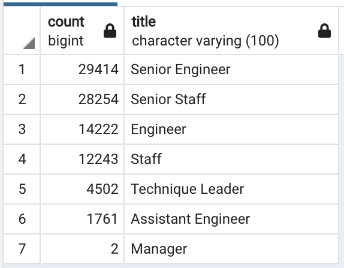
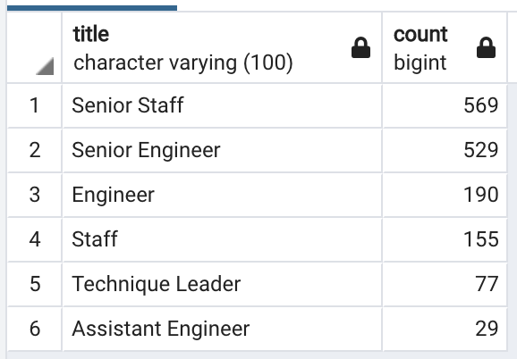
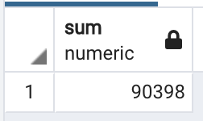

# Pewlett-Hackard-Analysis
Pewlett-Hackard is concerned about how many of their employees may be retiring soon. To address this concern I have been given two tasks. The first is to create a SQL table detailing all of the employees born between January 1, 1952 and December 31, 1955 and their respective titles who may be retiring soon. The second is to create a table of all employees born between January 1, 1965 and December 31, 1965 who would be eligible for a mentorship program to train replacements for those retiring. 

## Overview

## Results
- Employees Near Retirement:
  - 
  - There are 90,398 positions held by near retirement age employees that may need to be filled soon. 
  - The Senior Engineer and Senior Staff are the positions held by the most employees near retirment age.
  - There are only 2 Managers near retirement.
  - Engineers account for over half of the retirment age employees with 45,397 employees. 
- Eligible Mentors:
  - 
  - There are 1,549 available mentors based on the criteria provided.
  - The top 2 positions held by the eligible mentors match those of the retiring employees, Senior Staff and Senior Engineer.
  - There are no eligible Manager mentors.
  - All of the eligible mentors have been employeed since 2002 or before.

## Summary
Based on the query:
```
SELECT SUM(count) FROM retiring_titles;
```

Over the next few years over 90,000 employees may start retiring.

Based on the query:
```
SELECT COUNT(*) FROM mentorship_eligible;
```

By the given criteria there are only 1,549 employees elibile for the mentorship program.

In order to mentor 90,000 employees to take the place of all those retiring, the 1,549 eligible mentors would need to mentor almost 60 employees each. This does not seem reasonable. I suggest expanding the criteria for mentors to reasonably mentor enough replacements for those retiring. 

